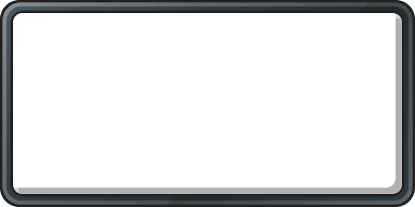

# Konosuba Fantastic Days - Custom Story Icons

This is a collection of generated icons for all Story Still and Story Backgrounds found in [this repo](https://github.com/HaiKonofanDesu/konofan-assets-jp-sortet) from the game Konosuba Fantastic Days.

These are following the style of the original game icons, but generated from the full images. The benefit is that this collection includes icons for all backgrounds and all stills, not only the ones that exist as rewards in the game and show up in the UI.

## What's here?

- [StoryBackgrounds](./StoryBackgrounds) - The generated icons for the Story Backgrounds.
- [StoryBackgrounds_webp95](./StoryBackgrounds_webp95) - The generated icons for the Story Backgrounds converted to .webp with a quality of 95.
- [StoryStill](./StoryStill) - The generated icons for the Story Still.
- [StoryStill_webp95](./StoryStill_webp95) - The generated icons for the Story Still converted to .webp with a quality of 95.

## How they were generated

These were generated by [downsizing](./Scripts/1_Downsize.sh) all the images in Backgrounds and Stills, then [overlaying](./Scripts/2_Overlay.sh) this frame on top of them:



The original Still images were first they were cropped using [this json file](./Scripts/StoryStillCropRects.json), which was manually created using [this tool](https://konofan-cropper.netlify.app).

The original backgrounds were simply cropped to remove the top and bottom 368px and 370px respectively.

Finally, the .pngs were [converted into .webp](./Scripts/3_ConvertToWebp.sh) for extra options.

----

## Doing this yourself

Make sure you have [ImageMagick](https://imagemagick.org/) installed, as well as [parallel](https://www.gnu.org/software/parallel/).

```sh
sudo apt-get install imagemagick parallel
```

Make sure also that you have downloaded the backgrounds and stills, and cropped the stills somehow.

Then, run the scripts in the following order:

```sh
# Set source directories for backgrounds and stills
STORY_BACKGROUNDS=../OriginalStoryBackgrounds
STORY_STILLS=../OriginalStoryStills

# Process story backgrounds: crop -> downsize -> add frame -> convert to webp

rm -rf ./StoryBackgrounds*
./Scripts/0_CropStoryBackgrounds.sh $STORY_BACKGROUNDS temp/StoryBackgrounds_Cropped
./Scripts/1_Downsize.sh temp/StoryBackgrounds_Cropped temp/StoryBackgrounds_Cropped_Downsized
./Scripts/2_AddFrame.sh temp/StoryBackgrounds_Cropped_Downsized StoryBackgrounds ./Scripts/KonoMiddleFrame.png
./Scripts/3_ConvertToWebp.sh StoryBackgrounds StoryBackgrounds_webp95 95

# Process story stills: crop -> downsize -> add frame -> convert to webp

rm -rf ./StoryStills*
./Scripts/0_CropStoryStills.sh $STORY_STILLS temp/StoryStills_Cropped ./Scripts/StoryStillCropRects.csv
./Scripts/1_Downsize.sh temp/StoryStills_Cropped temp/StoryStills_Cropped_Downsized
./Scripts/2_AddFrame.sh temp/StoryStills_Cropped_Downsized StoryStills ./Scripts/KonoMiddleFrame.png
./Scripts/3_ConvertToWebp.sh StoryStills StoryStills_webp95 95
```